# SonicWall ACL to Meraki MX Conversion

This script takes SonicWall ACLs and converts the IPv4 rules into compatible Meraki MX Rules. It'll build iterative or multi-source/multi-destination L3 based rules (Inbound, Outbound), as well as build Site-to-Site VPN rules.

**Supported SonicWall constructs**: 
* Network Objects
* Network Object Groups
* Range and FQDN Objects
* Zones (translated to VLANs) and Default Zone Behavior

**Object Processing and Rule Notes**:
* Inactive SonicWall Rules are ignored
* Range objects are not natively supported in Meraki, these are translated using a Policy Group containing individual CIDRs representing the range. The special `__range__` tag is appended to these group objects.
* Mixed IPv4 and FQDN groups are not supported, these are broken into separate groups with the `__ipv4__split` and `__fqdn__split` tag respectively. 2 Rules, one for each object, are created per original rule.
* Object groups and corresponding rules are translated as long as the group contains at least one valid object. Invalid objects are skipped and logged in `unprocessed_objects.txt`

**Warning**: This script assumes the target MX network and Site-to-Site Rule sets are not configured. Existing L3 and Site-to-Site Rules are overwritten!

## Contacts
* Trevor Maco

## Solution Components
* SonicWall
* Meraki

## Prerequisites
#### Meraki API Keys
In order to use the Meraki API, you need to enable the API for your organization first. After enabling API access, you can generate an API key. Follow these instructions to enable API access and generate an API key:
1. Login to the Meraki dashboard
2. In the left-hand menu, navigate to `Organization > Settings > Dashboard API access`
3. Click on `Enable access to the Cisco Meraki Dashboard API`
4. Go to `My Profile > API access`
5. Under API access, click on `Generate API key`
6. Save the API key in a safe place. The API key will only be shown once for security purposes, so it is very important to take note of the key then. In case you lose the key, then you have to revoke the key and a generate a new key. Moreover, there is a limit of only two API keys per profile.

> For more information on how to generate an API key, please click [here](https://developer.cisco.com/meraki/api-v1/#!authorization/authorization). 

> Note: You can add your account as Full Organization Admin to your organizations by following the instructions [here](https://documentation.meraki.com/General_Administration/Managing_Dashboard_Access/Managing_Dashboard_Administrators_and_Permissions).

#### SonicWall Config Files
There's 1 SonicWall config file necessary for this code to run: the 'show run' file.
1. **'show run' file**: export SonicWall config and save to a text file ([guide](https://www.sonicwall.com/support/knowledge-base/how-can-i-export-copy-of-configuration-settings/180411062859746/)). Move the text file to the code's root directory.

#### VLANs, Static Routes, and Addressing 
Source address rule imports will fail if the address/subnet does not exist on the target MX. To address this, follow these steps **BEFORE** running the code:
1. Enable `Routed` mode and `VLANs` on the MX.

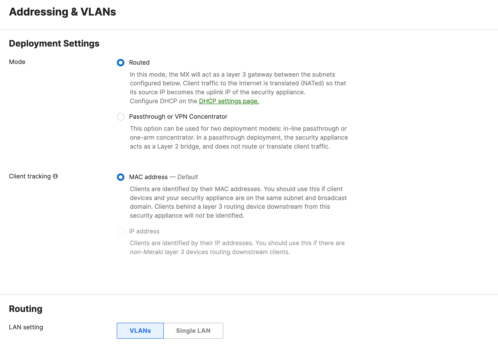

2. Create the proper VLAN's or Static routes on the dashboard which include each rule's source addresses. This can also be done in the `vlans.json` and `routes.json` files respectively > _see Usage section_

## Installation/Configuration
1. Clone this repository with `git clone [repository name]`
2. Add Meraki API key, Org Name, MX network name to environment located in `config.py`
```python
MERAKI_API_KEY = "<API KEY>"
ORG_NAME = "<ORG>"
NETWORK_NAME = "<NETWORK>"
```
3. Define Zones dictionary in `config.py`. If zone translates to a locally configured VLAN, include the VLAN number as the key value. For special Zones (like VPN) that don't translate to a local VLAN, leave the value blank. This dictionary is important for the `default inter-zone communication` feature (see usage) and the creation of a 2D CSV file detailing zone communication.
```python
ZONES = {
    "Zone Name": "Vlan Number",
    "WAN Zone": ""
}
```
4. Define Zone Keyword lists in `config.py`. These list are only relevant if using the `intelligent mapping of rules` (see usage). These keywords help determine if a rule should be placed in the inbound firewall rules list or site-to-site VPN firewall rules list. INBOUND matches rules with source zones in that list, while SITE2SITE matches rules with source and/or destination zones in the list.
```python
# Define special zone keywords which map rule to ruleset (for intelligent mapping)
INBOUND = ['']
SITE2SITE = ['']
```
5. Set up a Python virtual environment. Make sure Python 3 is installed in your environment, and if not, you may download Python [here](https://www.python.org/downloads/). Once Python 3 is installed in your environment, you can activate the virtual environment with the instructions found [here](https://docs.python.org/3/tutorial/venv.html).
6. Install the requirements with `pip3 install -r requirements.txt`

## Usage
1. To run the script, the main command is:
```python
python3 sonicwall_to_mx.py -r show-run-file.txt 
```
where _show-run-file.txt_ is the `show run` file from the prerequisites section.

2. Optionally, you may specify `-v vlans.json` and/or `-s routes.json` if you'd like to configure your VLANs and Static routes in those files instead of the Meraki Dashboard. Please consult those files for proper formatting and examples.

3. The code will also prompt at various stages if you'd like to enable optional features during the run:

#### Intelligent mapping of rules

* Rules are mapped to one of the 3 MX Rule sets (L3 outbound, L3 Inbound, Site-to-Site VPN) based on their source and destination zones and the keyword lists defined in the _Installation/Configuration_ section.
* By default, rules are placed in the L3 Outbound rules section if a keyword match is not found or if the feature is disabled.

#### Default inter-zone communication

* For 'Any Any' **Deny** rules defined between zones (Allow is implicit), the script can create VLAN based deny rules at the end of the outbound ACL list. This feature requires the Zone to VLAN mapping defined in the _Installation/Configuration_.
* Regardless of if this feature is enabled, a `zone_default_traffic_map.csv` file is created to show all inter-zone default behavior for reference.


The script will begin creating SonicWall Objects for the MX, reading in the ACL Rules, translating the rules, and applying them to the Meraki MX Network.

**Note**: Lines which fail to translate are written to `unprocessed_rules.txt`. Consult this file if a rule is missing. Objects which can't be processed are written to `unprocessed_objects.txt`.

> Script Output:

Initial Prompts:

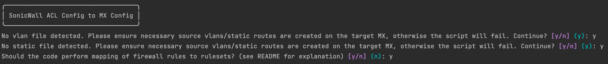

Creating VLANs if specified with `-v vlans.json`:

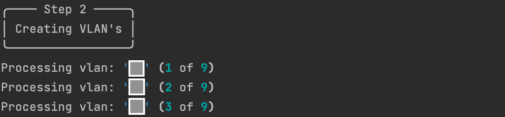

Creating Static routes if specified with `-s routes.json`:

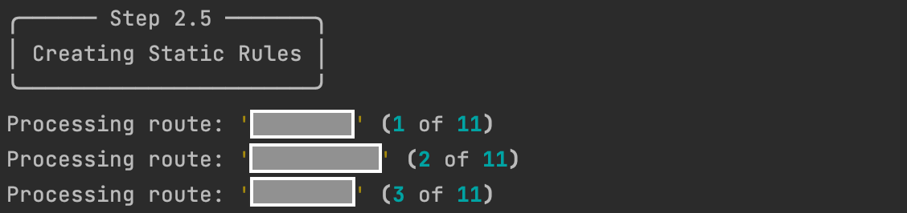

Parsing ACL Rules:

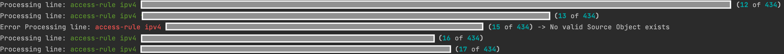

Results:

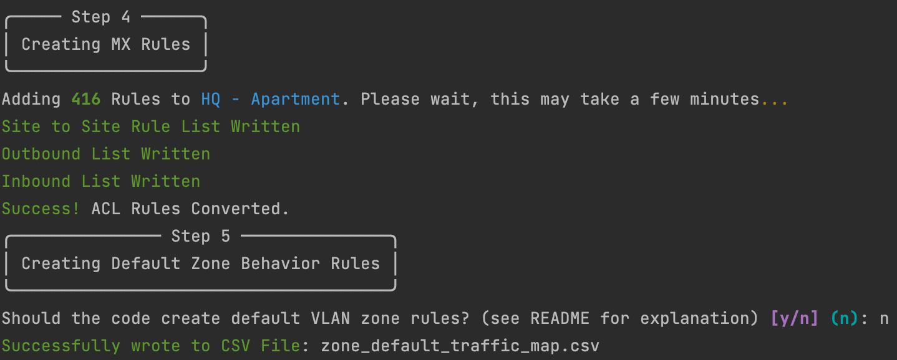


> Meraki Dashboard:

Initial Policy Objects:

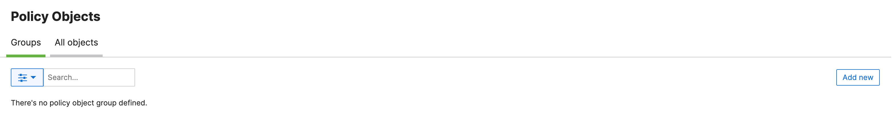

Initial Firewall Rules:

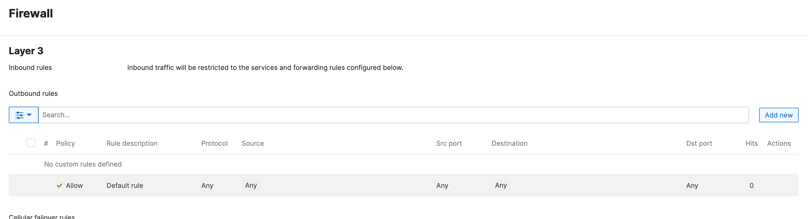
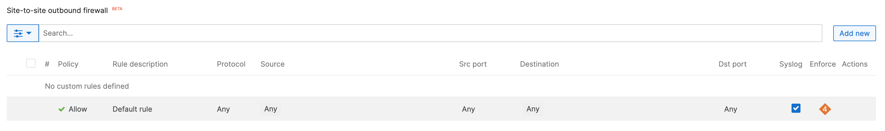

Policy Objects after creation:

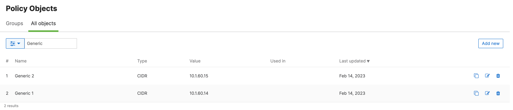

Policy Object Groups after creation:

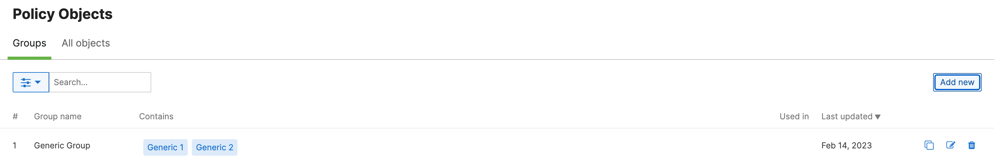

L3 Rules after creation:

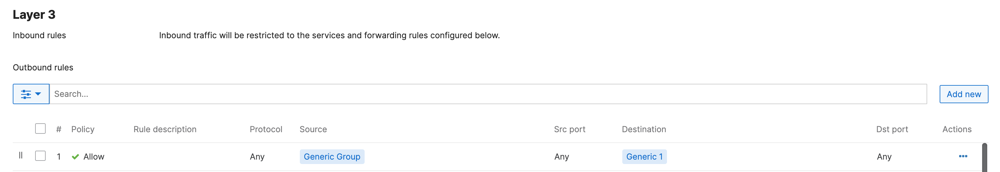

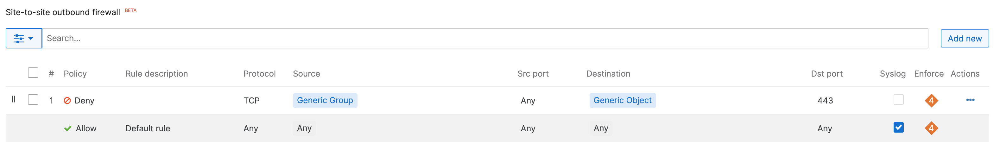

# Screenshots


### LICENSE

Provided under Cisco Sample Code License, for details see [LICENSE](LICENSE.md)

### CODE_OF_CONDUCT

Our code of conduct is available [here](CODE_OF_CONDUCT.md)

### CONTRIBUTING

See our contributing guidelines [here](CONTRIBUTING.md)

#### DISCLAIMER:
<b>Please note:</b> This script is meant for demo purposes only. All tools/ scripts in this repo are released for use "AS IS" without any warranties of any kind, including, but not limited to their installation, use, or performance. Any use of these scripts and tools is at your own risk. There is no guarantee that they have been through thorough testing in a comparable environment and we are not responsible for any damage or data loss incurred with their use.
You are responsible for reviewing and testing any scripts you run thoroughly before use in any non-testing environment.